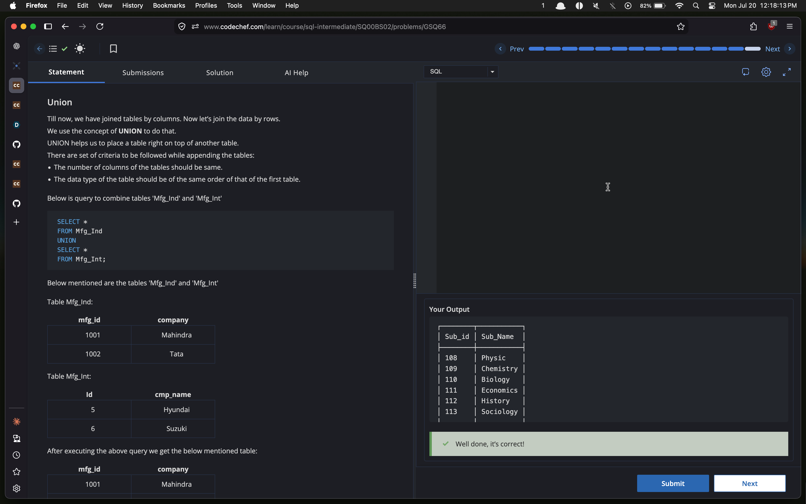
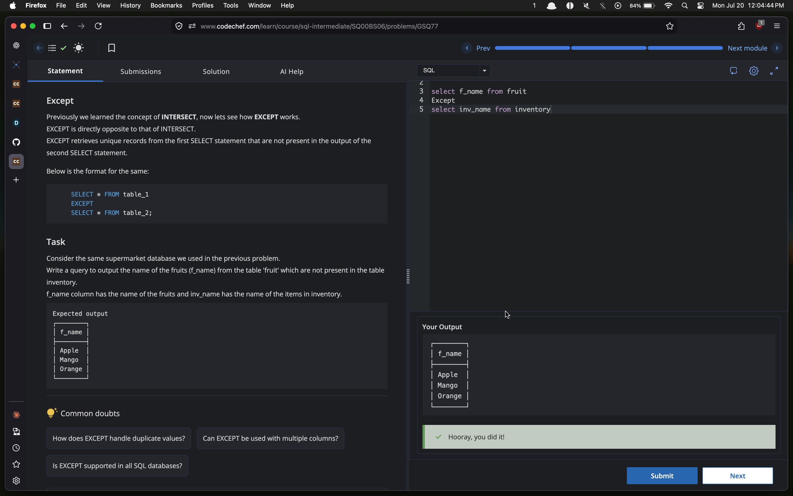
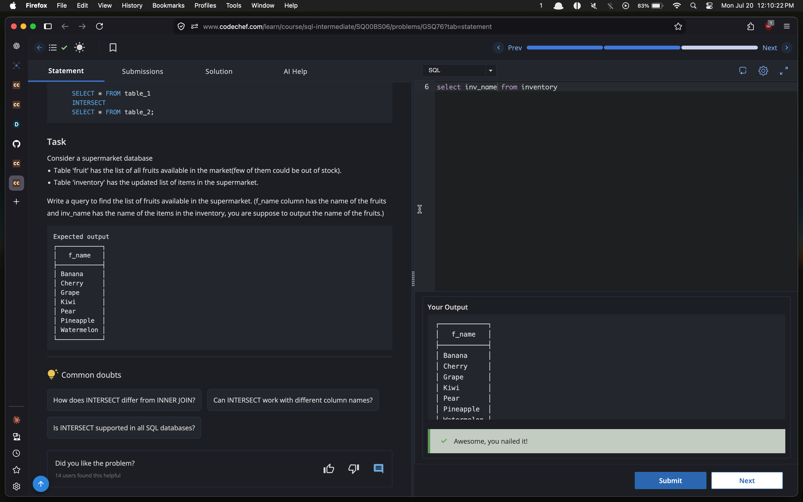

# Experiment 2 — SQL Set Operations

## Objective
To perform SQL set operations—`UNION`, `EXCEPT`, and `INTERSECT`—to combine, compare, and filter results from compatible `SELECT` queries.

> **Note:** Screenshots are stored locally for subparts **2.1**, **2.3**, and **2.4**. Subpart **2.2** is documented from its supplied task and SQL query; its source rows, final output, and local screenshot are not yet available.

## Summary

| Subpart | Operation | Purpose | Evidence |
| --- | --- | --- | --- |
| 2.1 | `UNION` | Combine the rows of `Arts` and `Science` subjects. | [2.1.png](2.1.png) |
| 2.2 | `UNION ALL` | Combine employee names while retaining duplicate names. | Pending |
| 2.3 | `EXCEPT` | Find fruit names that are absent from inventory. | [2.3.png](2.3.png) |
| 2.4 | `INTERSECT` | Find fruit names that are also present in inventory. | [2.4.png](2.4.png) |

---

## 2.1 — UNION

### Task
Stack the `Arts` table over the `Science` table and return the combined subject list.

### Code
```sql
SELECT *
FROM Arts
UNION
SELECT *
FROM Science;
```

### Input

**Arts**

| Sub_id | Sub_Name |
| ---: | --- |
| 111 | Economics |
| 112 | History |
| 113 | Sociology |

**Science**

| Sub_id | Sub_Name |
| ---: | --- |
| 108 | Physic |
| 109 | Chemistry |
| 110 | Biology |

### Output

| Sub_id | Sub_Name |
| ---: | --- |
| 108 | Physic |
| 109 | Chemistry |
| 110 | Biology |
| 111 | Economics |
| 112 | History |
| 113 | Sociology |

### Screenshot


---

## 2.2 — UNION ALL

### Task
XYZ Pvt. Ltd. maintains full-time and part-time employees. Return one table containing employee names from both the `Employee` and `pt_employee` tables. Duplicate names must be retained.

### Code
```sql
SELECT emp_name
FROM Employee
UNION ALL
SELECT emp_name
FROM pt_employee;
```

### Input

| Source table | Column used | Description |
| --- | --- | --- |
| `Employee` | `emp_name` | Full-time employee names, including some active part-time employees. |
| `pt_employee` | `emp_name` | Active and inactive part-time employee names. |

### Output

Output data is pending. Unlike `UNION`, `UNION ALL` preserves duplicate employee names returned by both queries.

### Screenshot

A local screenshot for this subpart has not yet been added to the experiment folder.

---

## 2.3 — EXCEPT

### Task
From the `fruit` table, return fruit names that are not present in the `inventory` table.

### Code
```sql
SELECT f_name
FROM fruit
EXCEPT
SELECT inv_name
FROM inventory;
```

### Input

The screenshot identifies the two input columns as `fruit.f_name` and `inventory.inv_name`. The full source rows are not displayed; the verified result is shown below.

| Source table | Column used | Role |
| --- | --- | --- |
| `fruit` | `f_name` | Complete fruit list |
| `inventory` | `inv_name` | Current inventory items |

### Output

| f_name |
| --- |
| Apple |
| Mango |
| Orange |

### Screenshot


---

## 2.4 — INTERSECT

### Task
Find the fruit names that are available in both the `fruit` and `inventory` tables.

### Code
```sql
SELECT f_name
FROM fruit
INTERSECT
SELECT inv_name
FROM inventory;
```

### Input

The screenshot identifies the two input columns as `fruit.f_name` and `inventory.inv_name`. The full source rows are not displayed; the verified common values are shown below.

| Source table | Column used | Role |
| --- | --- | --- |
| `fruit` | `f_name` | Complete fruit list |
| `inventory` | `inv_name` | Current inventory items |

### Output

| f_name |
| --- |
| Banana |
| Cherry |
| Grape |
| Kiwi |
| Pear |
| Pineapple |
| Watermelon |

### Screenshot


---

## Result

The SQL set operators produced the expected results:

- `UNION` combined the rows returned by two compatible queries and removed duplicate rows.
- `EXCEPT` returned values in the first query that were absent from the second query.
- `INTERSECT` returned values common to both queries.
