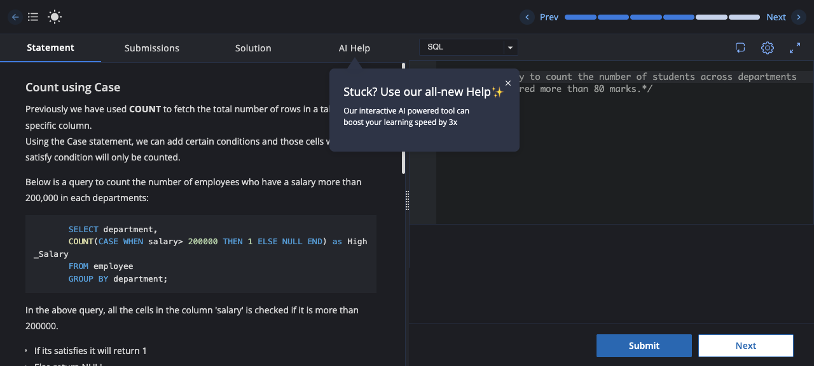

# Experiment 3 — Counting with CASE

## Objective
To use a `CASE` expression inside `COUNT` to count students who scored more than 80 marks in each department.

## Concept
`CASE` evaluates the condition for each row in the `student` table:

- If `Marks > 80`, the expression returns `1`.
- Otherwise, it returns `NULL`.
- `COUNT` counts the `1` values and ignores `NULL` values.

## Task
Write a query to count the number of students in each department who scored more than 80 marks. Alias the count column as `Dept_HighScore_Count`.

## Input
The `student` table uses the following columns:

| Column | Description |
| --- | --- |
| `St_id` | Student identifier |
| `St_name` | Student name |
| `Marks` | Student's marks |
| `Department` | Student's department |

## SQL Query
```sql
/* Write a query to count the number of students across departments who has scored more than 80 marks.*/
SELECT department, 
COUNT(CASE WHEN Marks > 80 THEN 1 ELSE NULL END) AS Dept_HighScore_Count
FROM student
GROUP BY department;
```

## Output

| department | Dept_HighScore_Count |
| --- | ---: |
| Biology | 0 |
| English | 0 |
| History | 3 |
| Math | 4 |
| Physics | 4 |

## Result
The query correctly counts only students with `Marks` greater than 80 within each `department` group.

## Screenshot
