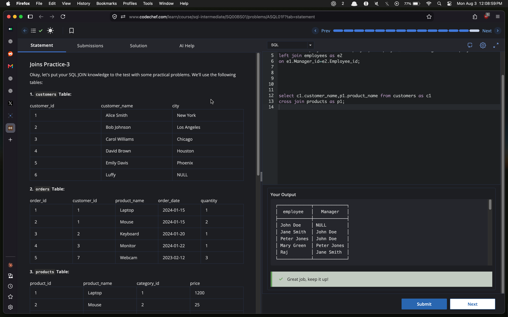

# Experiment 4 — SQL JOIN Operations

## Objective

To perform and compare SQL joins—`INNER JOIN`, `LEFT JOIN`, `RIGHT JOIN`, `FULL OUTER JOIN`, self joins, and `CROSS JOIN`—using related customer/order/product/category, student/course, and employee tables.

> **Evidence:** The supplied CodeChef captures show successful results for subparts **4.1** through **4.5**. The 4.5 capture is stored locally as [4.5.png](4.5.png); the remaining captures have not yet been added as standalone image files.

## Summary

| Subpart | JOIN operations | Purpose |
| --- | --- | --- |
| 4.1 | `LEFT JOIN`, `INNER JOIN` | Match customers to orders and products to orders. |
| 4.2 | `INNER JOIN`, `LEFT JOIN` | Compare matched student/course rows with all student rows. |
| 4.3 | `FULL OUTER JOIN` | Return every student and every course, including unmatched rows. |
| 4.4 | `INNER JOIN`, `FULL OUTER JOIN`, `RIGHT JOIN` | Apply joins to customer/order and product/category data. |
| 4.5 | Self `LEFT JOIN`, `CROSS JOIN` | Map employees to managers and form customer/product combinations. |

---

## 4.1 — Joins Practice 1

### Task 1 — Customers and Their Orders
Display each customer's name and product name, including customers who have not placed an order.

### SQL Query
```sql
SELECT c.customer_name, o.product_name
FROM customers c
LEFT JOIN orders o
    ON c.customer_id = o.customer_id;
```

### Verified result
The result includes the orders for Alice Smith, Bob Johnson, and Carol Williams, and preserves customers without a matching order with `NULL` order columns.

### Task 2 — Products and Their Orders
Display the product name and order date for products that have been ordered.

### SQL Query
```sql
SELECT p.product_name, o.order_date
FROM products p
INNER JOIN orders o
    ON p.product_name = o.product_name;
```

### Result
`LEFT JOIN` preserves every row from `customers`, while `INNER JOIN` returns only product/order pairs whose product names match.

---

## 4.2 — Left Joins

### Objective
Compare an `INNER JOIN` and a `LEFT JOIN` between the `student` and `course` tables using `Course_id`.

### Input columns

| Table | Relevant columns |
| --- | --- |
| `student` | `St_id`, `St_Name`, `Department`, `Course_id` |
| `course` | `Course_id`, `Course_Name`, `Credits`, `Prof_id` |

### Task 1 — Matching Student and Course Rows
Return only students with a matching course.

```sql
SELECT *
FROM student
JOIN course
    ON student.Course_id = course.Course_id;
```

### Task 2 — All Students and Their Courses
Return every student, leaving the course columns `NULL` when a student has no matching course.

```sql
SELECT *
FROM student
LEFT JOIN course
    ON student.Course_id = course.Course_id;
```

### Verified result
The `INNER JOIN` returns matched rows, including John Smith (`CS101`), Emily Brown (`HIS102`), David Lee (`MAT202`), and Sarah Johnson (`ENG201`). The `LEFT JOIN` additionally retains Michael Chen (`BIO103`) with `NULL` values for the unmatched course fields.

---

## 4.3 — Full Outer Joins

### Objective
Return all records from both the `student` and `course` tables, matching rows by `Course_id` where possible.

### SQL Query
```sql
SELECT *
FROM student
FULL OUTER JOIN course
    ON student.Course_id = course.Course_id;
```

### Verified result
The result contains:

- matched student/course records for `CS101`, `HIS102`, `MAT202`, and `ENG201`;
- Michael Chen's unmatched student record (`BIO103`) with `NULL` course fields; and
- the unmatched course `BIO104` with `NULL` student fields.

### Result
`FULL OUTER JOIN` combines the behavior of left and right joins: it retains all rows from both tables and fills the missing side of an unmatched row with `NULL` values.

---

## 4.4 — Joins Practice 2

### Task 1 — Customers and Orders
Display customer information together with matching order details.

```sql
SELECT c.customer_name, o.*
FROM customers c
INNER JOIN orders o
    ON c.customer_id = o.customer_id;
```

### Verified output

| customer_name | order_id | customer_id | product_name | order_date | quantity |
| --- | ---: | ---: | --- | --- | ---: |
| Alice Smith | 1 | 1 | Laptop | 2024-01-15 | 1 |
| Alice Smith | 2 | 1 | Mouse | 2024-01-15 | 2 |
| Bob Johnson | 3 | 2 | Keyboard | 2024-01-20 | 1 |
| Carol Williams | 4 | 3 | Monitor | 2024-01-22 | 1 |

### Task 2 — Products and Categories
Create a combined list of all products and all categories. Preserve unmatched rows from either table.

```sql
SELECT p.product_name, c.category_name
FROM products p
FULL OUTER JOIN categories c
    ON p.category_id = c.category_id;
```

### Task 3 — All Categories with Product Details
Display every category alongside its product name and price when a product belongs to it.

```sql
SELECT c.category_name, p.product_name, p.price
FROM products p
RIGHT JOIN categories c
    ON c.category_id = p.category_id;
```

### Result
The three queries demonstrate the practical differences between an `INNER JOIN` (matched customer/order pairs), a `FULL OUTER JOIN` (all products and categories), and a `RIGHT JOIN` (all categories, with product details when present).

---

## 4.5 — Joins Practice 3

### Task 1 — Employees and Their Managers
Use a self join on the `employees` table to list each employee and their manager. Employees without a manager must still be included.

```sql
SELECT e1.Employee_Name AS employee,
       e2.Employee_Name AS Manager
FROM employees AS e1
LEFT JOIN employees AS e2
    ON e1.Manager_id = e2.Employee_id;
```

### Verified output

| employee | Manager |
| --- | --- |
| John Doe | `NULL` |
| Jane Smith | John Doe |
| Peter Jones | John Doe |
| Mary Green | Peter Jones |
| Raj | Jane Smith |

### Task 2 — Customer/Product Combinations
Return every possible combination of customer name and product name.

```sql
SELECT c1.customer_name, p1.product_name
FROM customers AS c1
CROSS JOIN products AS p1;
```

### Result
The self `LEFT JOIN` compares `employees` to itself so that manager names can be returned while retaining the top-level manager. `CROSS JOIN` returns the Cartesian product: every customer paired with every product.

### Screenshot


---

## Overall Result

All five JOIN exercises produced the expected outputs in CodeChef. The experiment demonstrates how join type controls whether unmatched rows are excluded, retained from one table, retained from both tables, or combined with every row of another table.
